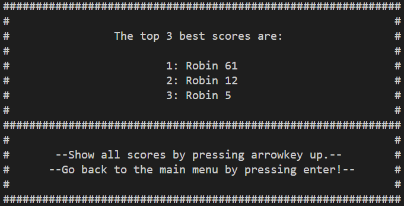

# Final Project for C++

For the C++ course you will have to build a nice app/game on your own.

**DEADLINE: 4th of January.** Doesn't mean you should build the app in december. Final touches can be made then.

All code should be placed inside this git project and be accompanied by a README and Makefile.

Choose 1 of the assignment options and inform your teacher about your choice.

## Option 2 - Snake

Build a Snake clone. Make sure the player's score is tracked in a scoreboard (save as json file for example). Allow the map that is played to be loaded from a file (make up your own format).

Extra could be a map editor to create maps.

## General

- The whole app/game should be object oriented. No global stuff. Main should also be clean.
- Code should be your own. You can research techniques and such but no code copy pasting. If teacher finds out (and he/she does 9 out of 10 times), the other guy/girl gets the grades and not you.
- Decent GIT history so teacher can track your progress through time. This means committing often and committing small. This is also part of proving your code is your own.
- Provide a decent README explaining your project, how it is structured, what fancy techniques you used, how someone can build your app and how to run it. Also add a couple of screenshots in your README off how your app looks.
- A makefile so the user only needs to use `make` to build your app.
- Check if your application runs on other systems (Windows vs Linux). If not, no problem, but make sure to document this inside your README.

## Screenshots

### Main menu

### Instructions

### Highscores

The scores get sorted from highest to lowest.

When pressing the arrow up key you get the full scoreboard:

### Settings

You can choose to use a standard map or the user created map:

### Playingfield

When playing with the standard map:

When playing with custom map:

### Game over screen

## Making a custom map!

To create a custom map you need to edit the playingfield.txt file.  
When editing the playing field you need to make sure the dimensions are correct!  
Standard it needs to be 60 characters wide and a height of 30.  
Make sure to not putt a wall in the direct middle of the playing field or to the left of it.

